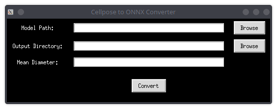

Sure, I'll create a README for your `Cellpose2onnx` project. Here's a draft:

---

# Cellpose2onnx

Adapted from arivis V4D

Cellpose2onnx is a tool for converting Cellpose models to the ONNX format. This conversion allows you to use the Cellpose models in various frameworks and environments that support ONNX, enhancing interoperability and deployment options.

## Features

- Convert individual Cellpose models to ONNX format.
- Convert all available Cellpose models to ONNX format.
- Easy-to-use graphical user interface (GUI) with a black theme.
- Support for specifying mean diameter for nuclei-based and other models.

## Requirements

- Python 3.x
- Cellpose
- PyTorch
- tkinter

## Installation

1. Clone the repository:

```sh
git clone https://github.com/yourusername/Cellpose2onnx.git
cd Cellpose2onnx
```

2. Install the required dependencies:

```sh
pip install cellpose torch tkinter
```

## Usage

### Using the GUI

1. Run the GUI application:

```sh
python cellpose2onnx_gui.py
```

2. Use the GUI to select the model path, output directory, and mean diameter. Click the "Convert" button to start the conversion.

### Using the Command Line

1. Convert an individual model:

```sh
python cellpose2onnx.py --model_path /path/to/your/model --output_directory /path/to/output --mean_diameter 30.0
```

2. Convert all available models:

```sh
python cellpose2onnx.py --output_directory /path/to/output
```

## GUI Screenshot



## License

This project is licensed under the MIT License. See the [LICENSE](LICENSE) file for details.

## Acknowledgments

Adapted from arivis V4D.
